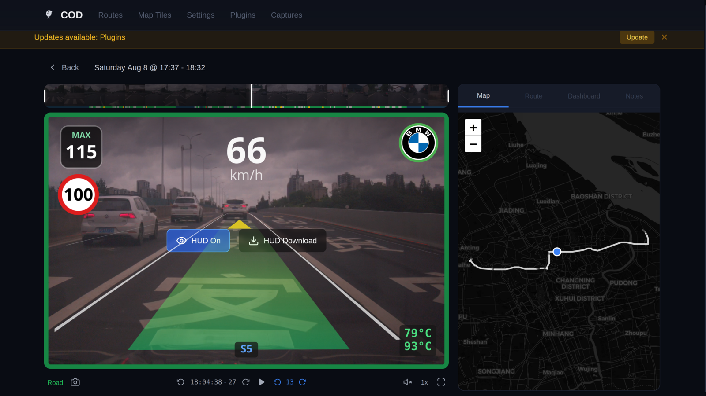
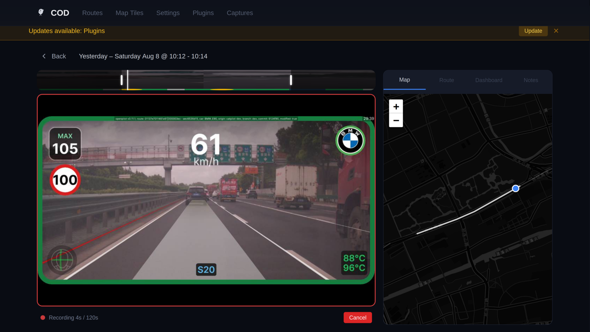

# COD — Connect on Device

A self-hosted web companion for [openpilot](https://github.com/commaai/openpilot). Runs directly on your comma device — browse routes, watch dashcam footage, manage plugins, and tune settings from any browser on your local network. No cloud, no account, no internet required.

**Why?** Without a comma PRIME subscription, [connect.comma.ai](https://connect.comma.ai) only retains routes for 7 days. Older routes disappear from the list — you lose all track record for studying past drives. COD reads directly from the device's local storage, so your routes are available as long as they're on disk.

COD also enables data collection workflows not possible with connect.comma.ai — scrub through video frame-by-frame, export high-resolution images with EXIF metadata, and annotate events with notes. We use this to collect speed limit sign training data for YOLO and verify OSM map contributions. Or simply bookmark moments worth remembering — wildlife sightings, scenic views, or road incidents.


*Route player with **HUD On** — the openpilot HUD overlaid live on dashcam footage, including plugin elements (speed-limit sign, road info, temperatures, brand emblem), with route map and event timeline.*


***HUD Download** renders the overlay into a shareable MP4 on-device, frame-exact with full plugin overlay fidelity.*

Integrated into [catpilot](https://github.com/catpilot-dev/catpilot) releases starting from `v0.10.3` — automatically installed on first boot.

## Access

Open **http://catpilot.local/** (or `http://<comma_device_ip>/`) in any browser on the same network as your device.

## Features

- **Route browser** — distance, duration, engagement stats, GPS map, soft-delete, star, and notes
- **Video playback** — stream front/wide/driver cameras, extract frames with EXIF metadata
- **HUD video** — render openpilot's HUD overlay onto dashcam footage as downloadable MP4 or live HLS stream
- **Screen captures** — screenshots from the screen_capture plugin; onroad taps become exact HUD frames automatically after you park, named by the moment you tapped
- **Note taking** — add notes to any route for documentation, debugging, or personal reference
- **Plugin management** — enable/disable plugins without SSH
- **Settings** — driving personality, speed limit offsets, experimental mode, SSH keys, and more
- **Model management** — swap driving models, check for updates, download new ones
- **Map tiles** — download/manage offline OSM tiles
- **Software updates** — check, download, install openpilot updates and switch branches

Safety first: while the car is driving, COD refuses any action that could
affect it — updates, reboots, model or plugin changes all wait until you're
parked.

## Setup

### catpilot users

No setup needed — catpilot installs COD automatically on first boot.

### Upstream openpilot or other forks

[How to connect to your comma device](https://docs.comma.ai/how-to/connect-to-comma/)

COD ships as a pre-built release tarball (the repo itself has no built
frontend — cloning it won't give you a working install). Download and start
the latest release:

```bash
ssh comma@<device_ip>

cd /data
curl -sfL $(curl -sf https://api.github.com/repos/catpilot-dev/connect-on-device/releases/latest \
  | grep -o 'https://[^"]*cod-[^"]*\.tar\.gz') | tar xz
bash connect-on-device/setup_service.sh
```

Once installed, COD keeps itself updated from its release channel.

## For developers

Architecture, subsystems, and development workflow are documented in
[DESIGN.md](DESIGN.md); the REST API in [API.md](API.md).

## License

MIT
